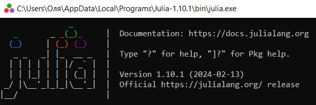
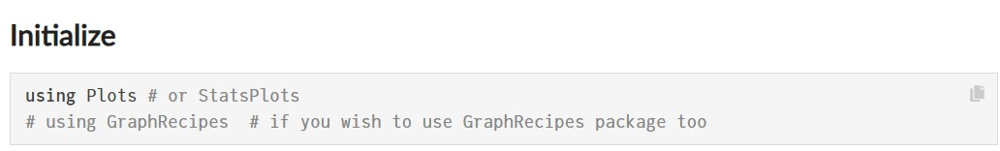
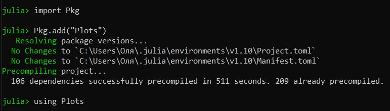
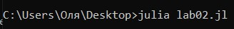
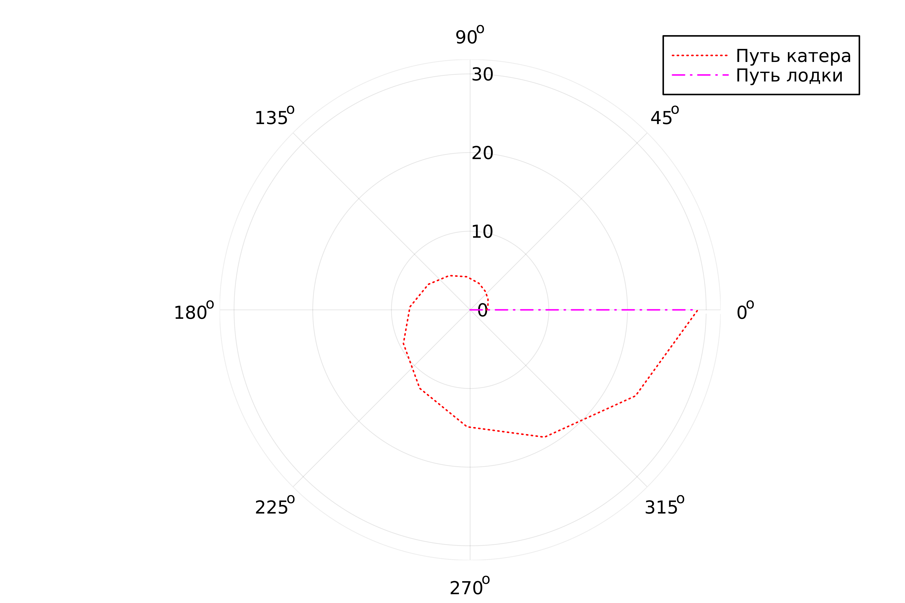
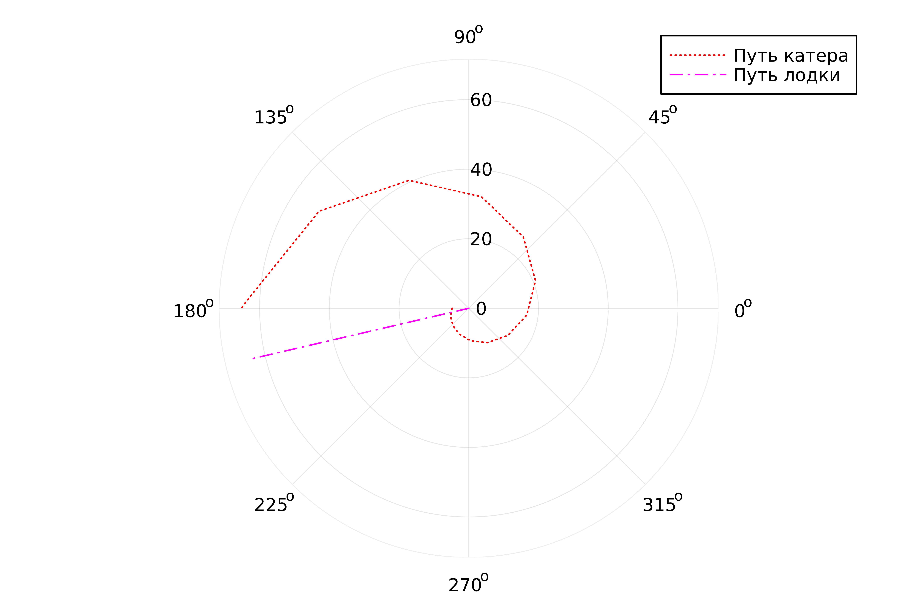

---
## Front matter
lang: ru-RU
title: "Презентация по лабораторной работе №2"
subtitle: "Задача о погоне"
author:
  - Лебедева О.А.
institute:
  - Российский университет дружбы народов, Москва, Россия
date: 17 февраля 2024

## i18n babel
babel-lang: russian 
babel-otherlangs: english 
mainfont: Arial 
monofont: Courier New 
fontsize: 12pt

## Formatting pdf
toc: false
toc-title: Содержание
slide_level: 2
aspectratio: 169
section-titles: true
theme: metropolis
header-includes:
 - \metroset{progressbar=frametitle,sectionpage=progressbar,numbering=fraction}
 - '\makeatletter'
 - '\beamer@ignorenonframefalse'
 - '\makeatother'
---

## Цель работы

Решить задачу о погоне, используя Julia и OpenModelica. Построить траекторию движения катера и лодки для двух случаев. 

## Теоретическое введение

Julia - это высокопроизводительный динамический язык программирования общего назначения, который изначально разрабатывался для решения задач научных вычислений и анализа данных. Julia отличается от других языков программирования своей скоростью выполнения и простотой синтаксиса, что делает его привлекательным выбором для решения широкого спектра задач, включая математическое моделирование, анализ данных, машинное обучение и многое другое.

OpenModelica - это свободная и открытая система для моделирования и симуляции динамических систем. Она предоставляет интегрированную среду разработки, где пользователи могут создавать, редактировать и анализировать модели на основе языка Modelica. OpenModelica поддерживает множество различных областей применения, включая инженерные системы, энергетику, теплофизику и другие.

## Задание

Формула определения номера задания: (Sn mod N) +1, где Sn — номер студбилета, N — количество заданий.

Для вычисления нашего варианта воспользуемся питоном:(рис. [-@fig:001])

{ #fig:001 width=70% }

## Задание

<i>Вариант 17 </i>

На море в тумане катер береговой охраны преследует лодку браконьеров.
Через определенный промежуток времени туман рассеивается, и лодка
обнаруживается на расстоянии 7,6 км от катера. Затем лодка снова скрывается в
тумане и уходит прямолинейно в неизвестном направлении. Известно, что скорость
катера в 2,6 раза больше скорости браконьерской лодки.
1. Запишите уравнение, описывающее движение катера, с начальными
условиями для двух случаев (в зависимости от расположения катера
относительно лодки в начальный момент времени).
2. Постройте траекторию движения катера и лодки для двух случаев.
3. Найдите точку пересечения траектории катера и лодки

## Выполнение лабораторной работы

Для выполнения лабораторной работы нам потребуется установка приложения Julia. Для этого скачаем нужную нам версию (для ОС Windows) на [официальном сайте](https://julialang.org/downloads/). (рис. [-@fig:002])

{ #fig:002 width=70% }

После загрузки и установки наше приложние откроется следующим образом: (рис. [-@fig:003])

{ #fig:003 width=70% }

## Выполнение лабораторной работы

Далее, для решения поставленной задачи, необходимо установить несколько библиотек для дальнейшей работы. Библиотека Plots предооставляет простой и гибкий интерфейс для создания графиков, а библиотека  (рис. [-@fig:004]) (рис. [-@fig:005]) (рис. [-@fig:006]) (рис. [-@fig:007]) (рис. [-@fig:008])

{ #fig:004 width=70% }

{ #fig:005 width=70% }

{ #fig:007 width=70% }

## Выполнение лабораторной работы

{ #fig:006 width=70% }

{ #fig:008 width=70% }

## Код лабораторной работы

    using Plots
    using DifferentialEquations

Подключаем библиотеки для дальнейшей работы.

    const a, n = 7.6, 2.6
    const r0, r0_2 = a / (n + 1), a / (n - 1)
    const T, T_2 = (0, 2 * pi), (-pi, pi)

Определение констант и начальных условий.
Задаём константы a и n из условия задачи.

r0 и r0_2 — начальные значения радиуса для двух разных задач ОДУ, рассчитанные на основе a и n.

T и T_2 — временные интервалы для решения каждой из задач.

## Код лабораторной работы

    F(u, p, t) = u / sqrt(n^2 - 1)

Определение Функции Для ОДУ

F — функция, определяющая ОДУ, где u — зависимая переменная (радиус), t — независимая переменная (время), и p — параметры уравнения, которые в данном случае не используются. Уравнение описывает изменение радиуса со временем.

    problem1 = ODEProblem(F, r0, T)
    result1 = solve(problem1, abstol=1e-8, reltol=1e-8)

    problem2 = ODEProblem(F, r0_2, T_2)
    result2 = solve(problem2, abstol=1e-8, reltol=1e-8)

Создаются две задачи ОДУ (problem1 и problem2) с использованием функции F, начальных значений и временных интервалов.
solve решает эти задачи с заданными абсолютной (abstol) и относительной (reltol) точностями.

## Код лабораторной работы

    plt1 = plot(proj=:polar, aspect_ratio=:equal, dpi=1000, legend=true, bg=:white)
    plot!(plt1, result1.t, result1.u, label="Путь катера", color=:red, lw=1, linestyle=:dot)

    max_radius1 = maximum(result1.u)
    random_angle1 = result1.t[rand(1:length(result1.t))]
    plot!(plt1, [0, random_angle1], [0, max_radius1], label="Путь лодки", color=:magenta, lw=1, linestyle=:dashdot)

Создаем полярный график с равным соотношением сторон, высоким разрешением, легендой и белым фоном.
Добавляем на график plt1 кривую, представляющую решение result1 (путь катера), с красной пунктирной линией.

## Код лабораторной работы

Вычисляем максимальный радиус из решения и выбирает случайный угол для иллюстрации предполагаемого пути лодки.
Добавляем линию для пути лодки с штрихпунктирным стилем.    

    plt2 = plot(proj=:polar, aspect_ratio=:equal, dpi=1000, legend=true, bg=:white)
    plot!(plt2, result2.t, result2.u, label="Путь катера", color=:red, lw=1, linestyle=:dot)

    max_radius2 = maximum(result2.u)
    random_angle2 = result2.t[rand(1:length(result2.t))]
    plot!(plt2, [0, random_angle2], [0, max_radius2], label="Путь лодки", color=:magenta, lw=1, linestyle=:dashdot)

Аналогичные шаги выполняются для второй задачи (plt2).

## Код лабораторной работы

    savefig(plt1, "lab02_01.png")
    savefig(plt2, "lab02_02.png")

Сохраняем созданные графики в файлы PNG для дальнейшего использования или анализа.

Теперь мы переходим в консоль Windows и запускаем наш файл. (рис. [-@fig:009])

{ #fig:009 width=70% }

## Код лабораторной работы

В результате выполнения в той же папке, где находилась наша программа, появится два графика. (рис. [-@fig:010]) (рис. [-@fig:011])

{ #fig:010 width=70% }

{ #fig:011 width=70% }

## Примечание

К сожалению, OpenModelica не предоставляет графики для полярных координат. Но мы можем написать реализацию программы.

    model Problem1
    constant Real a = 7.6;
    constant Real n = 2.6;
    constant Real r0 = a / (n + 1);
    constant Real T_start = 0;
    constant Real T_end = 2 * Modelica.Constants.pi;
    Real u;

    equation
    der(u) = u / sqrt(n^2 - 1);

    initial equation
    u = r0;

    end Problem1;

## Примечание

    model Problem2
    constant Real a = 7.6;
    constant Real n = 2.6;
    constant Real r0_2 = a / (n - 1);
    constant Real T_start = -Modelica.Constants.pi;
    constant Real T_end = Modelica.Constants.pi;
    Real u;

    equation
    der(u) = u / sqrt(n^2 - 1);

    initial equation
    u = r0_2;

    end Problem2;

## Заключение

Познакомились с приложениями Julia и OpenModelica. Реализовали задачу о погоне, вывели траектории при помощи графиков.

## Библиографическая справка

[1] Документация по Julia: https://docs.julialang.org/en/v1/

[2] Документация по OpenModelica: https://openmodelica.org/
