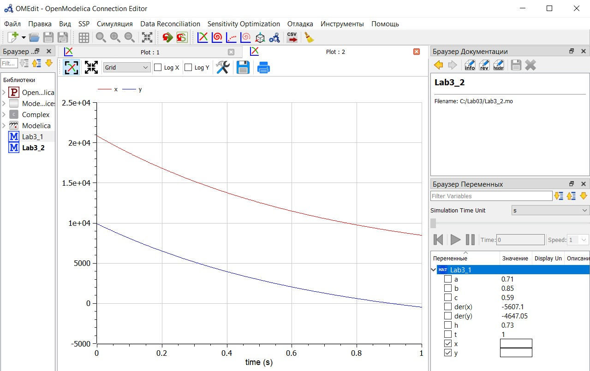
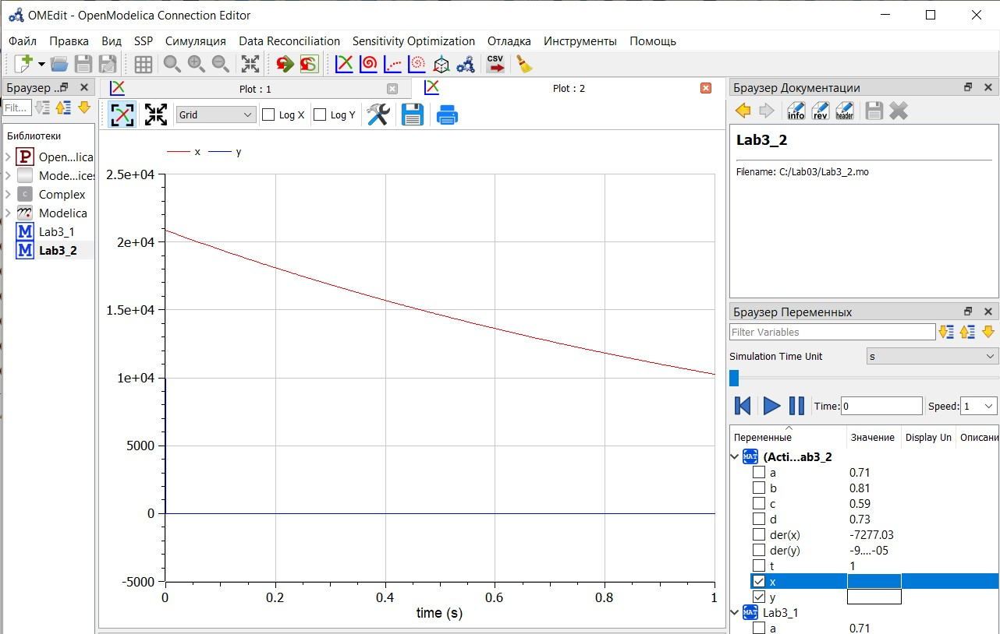
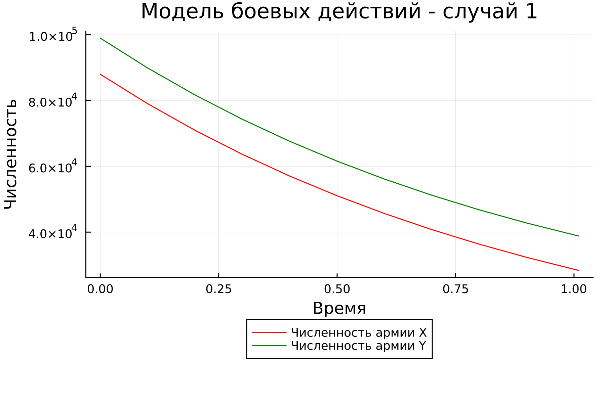
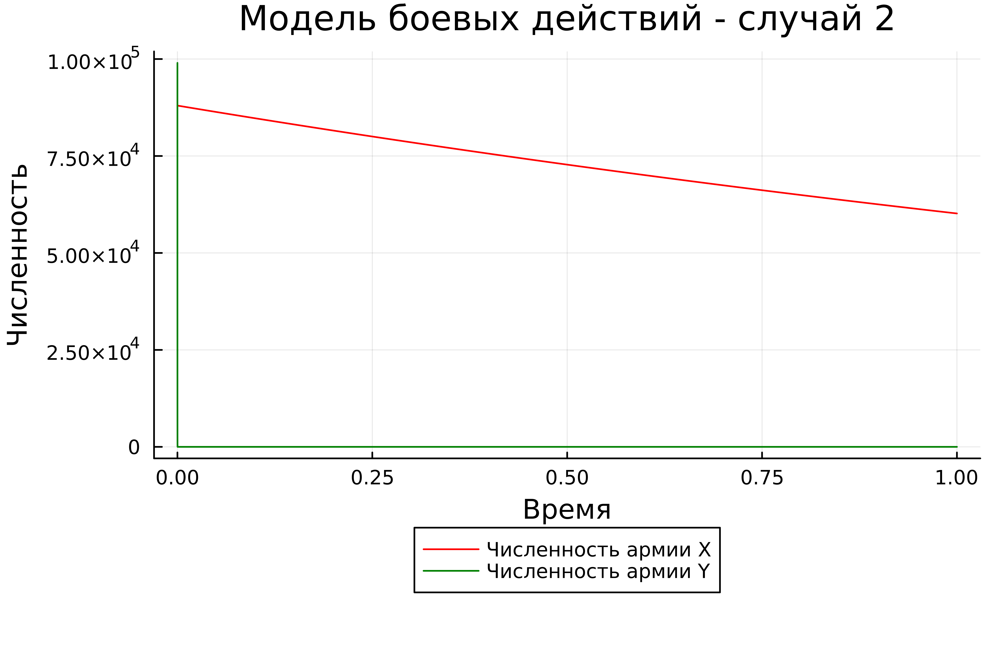

---
## Front matter
title: "Отчет по лабораторной работе № 3"
subtitle: "Модель боевых действий"
author: "Лебедева Ольга Андреевна"

## Generic otions
lang: ru-RU
toc-title: "Содержание"

## Bibliography
bibliography: bib/cite.bib
csl: pandoc/csl/gost-r-7-0-5-2008-numeric.csl

## Pdf output format
toc: true # Table of contents
toc-depth: 2
lof: true # List of figures
#lot: true # List of tables
fontsize: 12pt
linestretch: 1.5
papersize: a4
documentclass: scrreprt
## I18n polyglossia
polyglossia-lang:
  name: russian
  options:
	- spelling=modern
	- babelshorthands=true
polyglossia-otherlangs:
  name: english
## I18n babel
babel-lang: russian
babel-otherlangs: english
## Fonts
mainfont: PT Serif
romanfont: PT Serif
sansfont: PT Sans
monofont: PT Mono
mainfontoptions: Ligatures=TeX
romanfontoptions: Ligatures=TeX
sansfontoptions: Ligatures=TeX,Scale=MatchLowercase
monofontoptions: Scale=MatchLowercase,Scale=0.9
## Biblatex
biblatex: true
biblio-style: "gost-numeric"
biblatexoptions:
  - parentracker=true
  - backend=biber
  - hyperref=auto
  - language=auto
  - autolang=other*
  - citestyle=gost-numeric
## Pandoc-crossref LaTeX customization
figureTitle: "Рис."
tableTitle: "Таблица"
listingTitle: "Листинг"
lofTitle: "Список иллюстраций"
lotTitle: "Список таблиц"
lolTitle: "Листинги"
## Misc options
indent: true
header-includes:
  - \usepackage{indentfirst}
  - \usepackage{float} # keep figures where there are in the text
  - \floatplacement{figure}{H} # keep figures where there are in the text
---

# Цель работы

Создать модель боевых действий, используя Julia и OpenModelica. Построить графики изменения численности войск армии. 

# Теоретическое введение

Julia - это высокопроизводительный динамический язык программирования общего назначения, который изначально разрабатывался для решения задач научных вычислений и анализа данных. Julia отличается от других языков программирования своей скоростью выполнения и простотой синтаксиса, что делает его привлекательным выбором для решения широкого спектра задач, включая математическое моделирование, анализ данных, машинное обучение и многое другое. Подробнее можно почитать [1].

OpenModelica - это свободная и открытая система для моделирования и симуляции динамических систем. Она предоставляет интегрированную среду разработки, где пользователи могут создавать, редактировать и анализировать модели на основе языка Modelica. OpenModelica поддерживает множество различных областей применения, включая инженерные системы, энергетику, теплофизику и другие. Подробнее можно почитать [2].

Модель боевых действий — это математический инструмент, используемый для описания и анализа динамики военных конфликтов между двумя или более сторонами. Эти модели могут учитывать различные факторы, такие как численность войск, стратегии командования, географические условия и военно-технические возможности сторон. Они применяются для изучения поведения армий в бою, прогнозирования исходов конфликтов, оптимизации военных стратегий и разработки эффективных методов ведения боевых действий. В современных исследованиях используются как классические детерминированные подходы, так и стохастические модели, позволяющие учитывать случайные и непредсказуемые аспекты военных операций. Подробнее можно почитать [3].

# Задание

<i>Вариант 17 </i>

Между страной Х и страной У идет война. Численность состава войск исчисляется от начала войны, и являются временными функциями x(t) и y(t). В
начальный момент времени страна Х имеет армию численностью 20850 человек, а в распоряжении страны У армия численностью в 9900 человек. Для упрощения модели считаем, что коэффициенты a, b, c, h постоянны. Также считаем P(t) и Q(t) непрерывными функциями. 

Постройте графики изменения численности войск армии Х и армии У для следующих случаев:

1. Модель боевых действий между регулярными войсками:

$$ {dx\over{dt}} = -0.71x(t)-0.85y(t)+sin(6t) + 1 $$
$$ {dy\over{dt}} = -0.59x(t)-0.73y(t)+cos(7t)+ 1 $$

2. Модель ведение боевых действий с участием регулярных войск и партизанских отрядов:

$$ {dx\over{dt}} = -0.71x(t)-0.81y(t)+1.5sin(2t) $$
$$ {dy\over{dt}} = -0.59x(t)y(t)-0.73y(t)+1.5cos(t) + 1 $$

# Выполнение лабораторной работы

## OpenModelica

Для выполнения лабораторной работы нам потребуется установка приложения OpenModelica. Для этого скачаем нужную нам версию (для ОС Windows) на [официальном сайте](https://build.openmodelica.org/omc/builds/windows/releases/1.22/1/64bit/). Cм. [рис. 1](#fig:001)

{ #fig:001 width=70% }

После успешной установки приложения, настраиваем его и добавляем новые классы.
Для первого случая пишем следующий код:

    model Lab3_1

    Real x;
    Real y;
    Real a = 0.71;
    Real b = 0.85;
    Real c = 0.59;
    Real h = 0.73;
    Real t = time;

    initial equation
    x = 20850;
    y = 9900;

    equation
    der(x) = -a*x - b*y + sin(6*t) + 1;
    der(y) = -c*x - h*y + cos(7*t) + 1;

    end Lab3_1;

Нажимаем кнопку "проверить модель", далее - "симулировать". Получаем график изменения численности армий для первого случая. Cм. [рис. 2](#fig:002)

{ #fig:002 width=70% }

Аналогично для второго сценария:

    model Lab3_2

    Real x;
    Real y;
    Real a = 0.71;
    Real b = 0.81;
    Real c = 0.59;
    Real d = 0.73;
    Real t = time;

    initial equation
    x = 20850;
    y = 9900;

    equation
    der(x) = -a*x - b*y + 1.5*sin(2*t);
    der(y) = -c*x*y - d*y + 1.5*cos(t);

    end Lab3_2;

И получаем график: Cм. [рис. 3](#fig:003)

{ #fig:003 width=70% }

## Julia

Напишем код на Jilia сразу для двух сценариев:

    using Plots;
    using DifferentialEquantions;

    function one(du, u, p, t)
        du[1] = -0.71*u[1] - 0.85u[2] + sin(6*t) + 1
        du[2] = -0.59*u[1] - 0.73u[2] + sin(7*t) + 1
    end 

    function two(du, u, p, t)
        du[1] = -0.71*u[1] - 0.81u[2] + 1.5*sin(2*t)
        du[2] = -0.59*u[1] - 0.73u[2] + 1.5*cos(t)
    end 

    const people = Float64[20850, 9900]
    const prom1 = [0.0, 1.01]
    const prom2 = [0.0, 1.01]

    prob1 = ODEProblem(one, people, prom1)
    prob2 = ODEProblem(two, people, prom2)

    sol1 = solve(prob1, dtmax = 0.1)
    sol2 = solve(prob2, dtmax = 0.000001)

    A1 = [u[1] for u in sol1.u]
    A2 = [u[2] for u in sol1.u]
    T1 = [t for t in sol1.t]
    A3 = [u[1] for u in sol2.u]
    A4 = [u[2] for u in sol2.u]
    T2 = [t for t in sol2.t]

    plt1 = plot(dpi = 300, legend= true, bg =:white)
    plot!(plt1, xlabel="Время", ylabel="Численность", title="Модель боевых действий - случай 1", legend=:outerbottom)
    plot!(plt1, T1, A1, label="Численность армии X", color =:red)
    plot!(plt1, T1, A2, label="Численность армии Y", color =:green)
    savefig(plt1, "lab03_1.png")

    plt2 = plot(dpi = 1200, legend= true, bg =:white)
    plot!(plt2, xlabel="Время", ylabel="Численность", title="Модель боевых действий - случай 2", legend=:outerbottom)
    plot!(plt2, T2, A3, label="Численность армии X", color =:red)
    plot!(plt2, T2, A4, label="Численность армии Y", color =:green)
    savefig(plt2, "lab03_2.png")

С помощью командной строки запустим исполнение файла. Cм. [рис. 4](#fig:004) Cм. [рис. 5](#fig:005)   

{#fig:004 width=70%}

{ #fig:005 width=70% }

# Заключение

Познакомились с приложением OpenModelica наряду с Julia. Реализовали модель боевых действий для двух армий. Построили графики изменения численности войск. 

# Библиографическая справка 

[1] Документация по Julia: https://docs.julialang.org/en/v1/

[2] Документация по OpenModelica: https://openmodelica.org/

[3] Документация по модели боевых действий: http://crm.ics.org.ru/uploads/crmissues/crm_2020_1/2020_01_14.pdf