---
## Front matter
title: "Отчет по лабораторной работе № 4"
subtitle: "Модель гармонических колебаний"
author: "Лебедева Ольга Андреевна"

## Generic otions
lang: ru-RU
toc-title: "Содержание"

## Bibliography
bibliography: bib/cite.bib
csl: pandoc/csl/gost-r-7-0-5-2008-numeric.csl

## Pdf output format
toc: true # Table of contents
toc-depth: 2
lof: true # List of figures
#lot: true # List of tables
fontsize: 12pt
linestretch: 1.5
papersize: a4
documentclass: scrreprt
## I18n polyglossia
polyglossia-lang:
  name: russian
  options:
	- spelling=modern
	- babelshorthands=true
polyglossia-otherlangs:
  name: english
## I18n babel
babel-lang: russian
babel-otherlangs: english
## Fonts
mainfont: PT Serif
romanfont: PT Serif
sansfont: PT Sans
monofont: PT Mono
mainfontoptions: Ligatures=TeX
romanfontoptions: Ligatures=TeX
sansfontoptions: Ligatures=TeX,Scale=MatchLowercase
monofontoptions: Scale=MatchLowercase,Scale=0.9
## Biblatex
biblatex: true
biblio-style: "gost-numeric"
biblatexoptions:
  - parentracker=true
  - backend=biber
  - hyperref=auto
  - language=auto
  - autolang=other*
  - citestyle=gost-numeric
## Pandoc-crossref LaTeX customization
figureTitle: "Рис."
tableTitle: "Таблица"
listingTitle: "Листинг"
lofTitle: "Список иллюстраций"
lotTitle: "Список таблиц"
lolTitle: "Листинги"
## Misc options
indent: true
header-includes:
  - \usepackage{indentfirst}
  - \usepackage{float} # keep figures where there are in the text
  - \floatplacement{figure}{H} # keep figures where there are in the text
---

# Цель работы

Построить модели гармонических колебаний, используя Julia и OpenModelica. 

# Теоретическое введение

Фазовый портрет - это графическое представление динамики системы в фазовом пространстве, где каждое состояние системы представлено точкой. На графике обычно изображаются значения различных переменных системы в зависимости друг от друга. Фазовый портрет позволяет визуализировать поведение системы со временем и выявить основные характеристики ее динамики, такие как устойчивость, периодичность, предельные циклы и т. д. Фазовые портреты широко используются в различных науках, включая физику, математику, биологию и инженерные науки, для анализа и моделирования динамических систем [1].

Дифференциальные уравнения (ДУ) с правой частью равной нулю, или однородные дифференциальные уравнения, представляют собой уравнения, в которых отсутствует внешнее воздействие или источник изменений. Они описывают системы, в которых изменения зависят только от текущего состояния системы и ее параметров. Решение таких уравнений позволяет определить стационарные состояния системы и проанализировать ее устойчивость к возмущениям. Однородные дифференциальные уравнения широко применяются в различных областях науки и инженерии для моделирования и анализа различных процессов, таких как колебания, динамика систем управления, теплопроводность и диффузия веществ [2].

Дифференциальные уравнения с правой частью, зависящей от переменных или параметров системы, описывают динамику системы с учетом внешних воздействий или источников изменений. В таких уравнениях правая часть представляет собой функцию времени, переменных системы или других параметров, которая описывает воздействие на систему в каждый момент времени. Решение таких уравнений позволяет моделировать поведение системы в различных условиях и прогнозировать ее развитие во времени. Дифференциальные уравнения с переменной правой частью находят применение в широком спектре областей, включая физику, биологию, экономику, механику и другие науки, где они используются для анализа и моделирования различных процессов и явлений [3].

# Задание

<i>Вариант 17 </i>

Постройте фазовый портрет гармонического осциллятора и решение уравнения
гармонического осциллятора для следующих случаев:

1. Колебания гармонического осциллятора без затуханий и без действий внешней
силы:
    $$ x'' + 12x = 0 $$

2. Колебания гармонического осциллятора c затуханием и без действий внешней
силы:
    $$ x'' + 11x' + 2x = 0 $$

3. Колебания гармонического осциллятора c затуханием и под действием внешней
силы:
    $$ x'' + 11x' + 2x = 2cos(2t) $$

На интервале t [0; 51] (шаг 0.05) с начальными условиями  x0 = 0.5, y0 = 1.

# Выполнение лабораторной работы

## Julia

Напишем код на Jilia для случая 1: колебания гармонического осциллятора без затуханий и без действий внешней силы. 

using DifferentialEquations, Plots

    function oscillator1!(du, u, p, t)
        du[1] = u[2]
        du[2] = -12*u[1]

    u0 = [0.5, 1.0]   
    tspan = (0.0, 51.0) 

    prob1 = ODEProblem(oscillator1!, u0, tspan)
    sol1 = solve(prob1, Tsit5(), reltol=1e-8, abstol=1e-8)

    plot(sol, title = "Harmonic Oscillator without Damping", xlabel = "Time", ylabel = "Position/Velocity")
    savefig("oscillator1_solution.png")

Запустим код при помощи командной строки и получим два изображения: Cм. [рис. 1](#fig:001), Cм. [рис. 2](#fig:002)

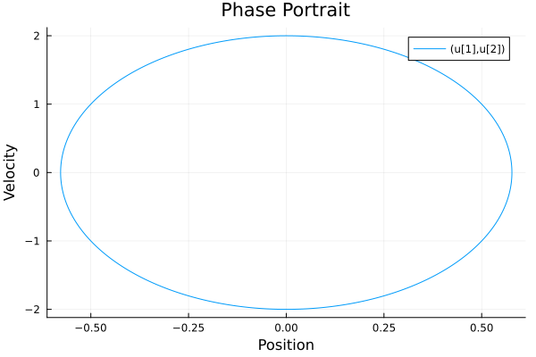{ #fig:001 width=70% }

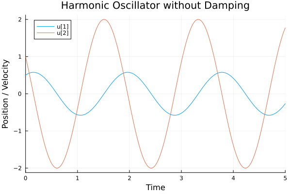{ #fig:002 width=70% }

Напишем код на Jilia для случая 2: колебания гармонического осциллятора c затуханием и без действий внешней
силы. 

    using DifferentialEquations, Plots

    function oscillator2!(du, u, p, t)
        du[1] = u[2]
        du[2] = -2*u[1] - 11*u[2]
    end

    u0 = [0.5, 1.0]
    tspan = (0.0, 5.0)

    prob2 = ODEProblem(oscillator2!, u0, tspan)
    sol2 = solve(prob2, Tsit5(), reltol=1e-8, abstol=1e-8)

    plot(sol2, title="Damped Harmonic Oscillator without External Force", xlabel="Time", ylabel="Position / Velocity")
    savefig("oscillator2_solution.png")

    plot(sol2, vars=(1,2), title="Phase Portrait", xlabel="Position", ylabel="Velocity")
    savefig("oscillator2_phase_portrait.png")

Запустим код при помощи командной строки и получим два изображения: Cм. [рис. 3](#fig:003), Cм. [рис. 4](#fig:004)

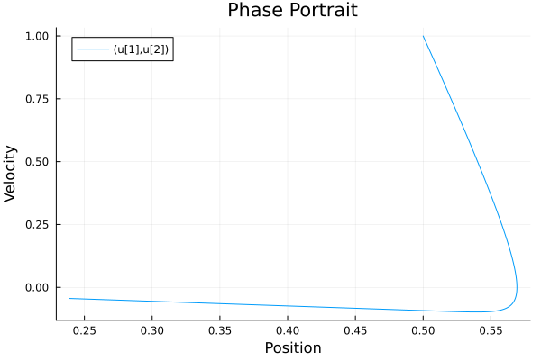{ #fig:003 width=70% }

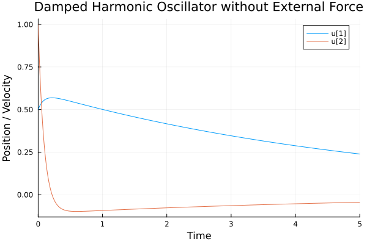{ #fig:004 width=70% }

Напишем код на Jilia для случая 3: колебания гармонического осциллятора c затуханием и под действием внешней
силы. 

    using DifferentialEquations, Plots

    function forced_damped_oscillator!(dx, x, params, t)
        dx[1] = x[2]
        dx[2] = 2*cos(2*t) - 2*x[1] - 21*x[2]
    end

    x0 = [0.5, 1.0]  # Начальные условия для смещения и скорости
    tspan = (0.0, 10.0)  # Диапазон времени

    prob = ODEProblem(forced_damped_oscillator!, x0, tspan)
    sol = solve(prob)

Запустим код при помощи командной строки и получим два изображения: Cм. [рис. 5](#fig:005), Cм. [рис. 6](#fig:006)

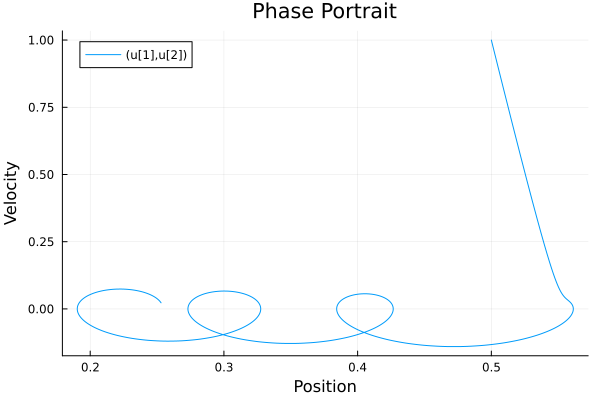{ #fig:003 width=70% }

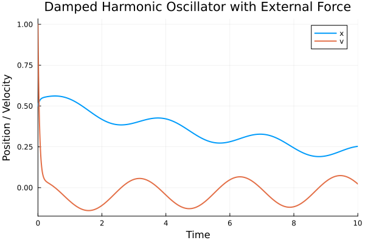{ #fig:004 width=70% }   

## OpenModelica

Напишем код на OpenModelica для случая 1: колебания гармонического осциллятора без затуханий и без действий внешней силы. 

    model HarmonicOscillatorWithoutDamping
        Real x(start = 0.5);
        Real y(start = 1.0);
    equation
        der(x) = v;
        der(v) = -12*x    
    end HarmonicOscillatorWithoutDamping;

Запустим код при помощи кнопок "проверить модель" -> "установки симуляции" -> "симулировать". Не забываем в найстройках указать заданные нам ачальные условияю Cм. [рис. 7](#fig:007)

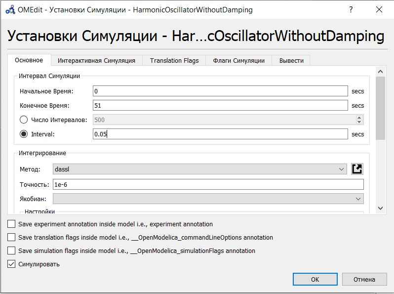{ #fig:007 width=70% }

Нажимаем галочки x и v для отображения графиков: Cм. [рис. 8](#fig:008), Cм. [рис. 9](#fig:009)

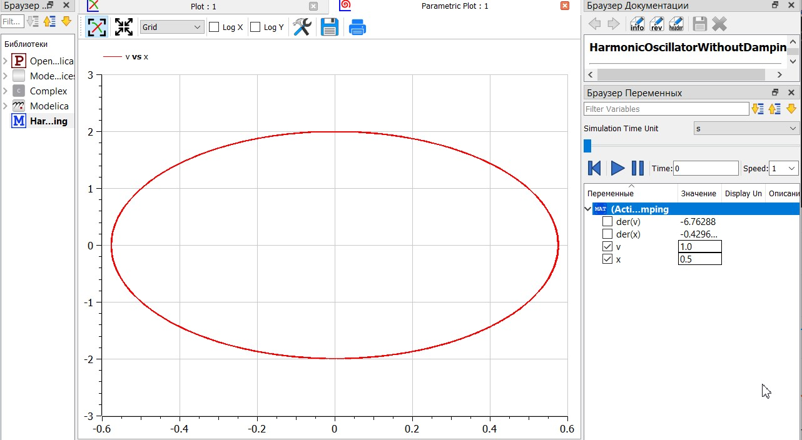{ #fig:008 width=70% }

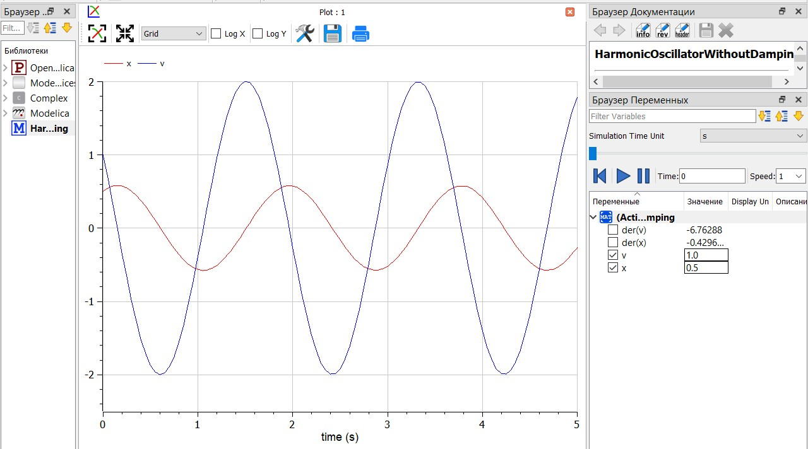{ #fig:009 width=70% }

Напишем код для случая 2: колебания гармонического осциллятора c затуханием и без действий внешней
силы. . 

    model DampedOscillatorWithoutExternalForce
    Real x(start=0.5); 
    Real v(start=1.0); 
    initial equation
    equation
    der(x) = v; 
    der(v) = -2*x - 11*v; 
    end DampedOscillatorWithoutExternalForce;

Запустим код. Нажимаем галочки x и v для отображения графиков: Cм. [рис. 10](#fig:010), Cм. [рис. 11](#fig:011)

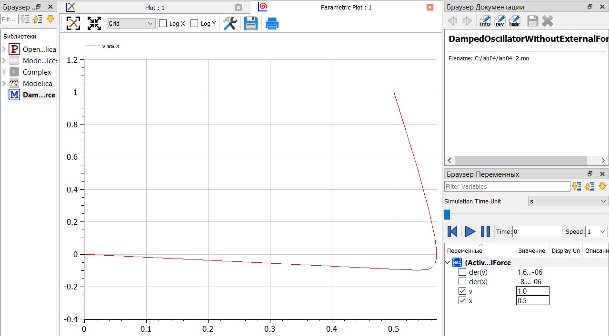{ #fig:010 width=70% }

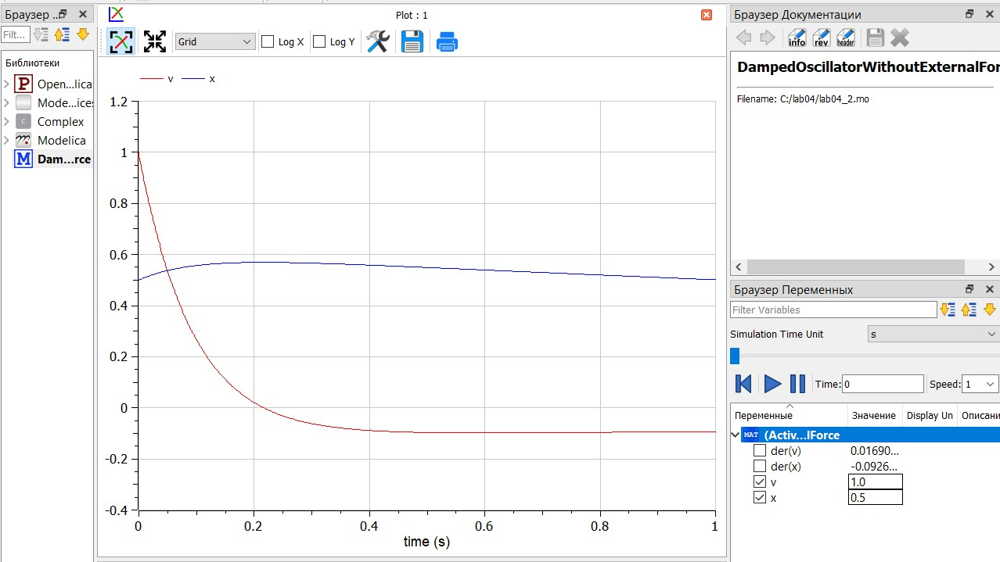{ #fig:011 width=70% }

Напишем код на OpenModelica для случая 3: колебания гармонического осциллятора c затуханием и под действием внешней
силы. . 

    model ForcedDampedOscillator
    Real x(start=0.5); 
    Real v(start=1.0); 
    equation
    der(x) = v;
    der(v) = 2*cos(2*time) - 2*x - 21*v; 
    end ForcedDampedOscillator;

Запустим код. Нажимаем галочки x и v для отображения графиков: Cм. [рис. 12](#fig:012), Cм. [рис. 13](#fig:013)

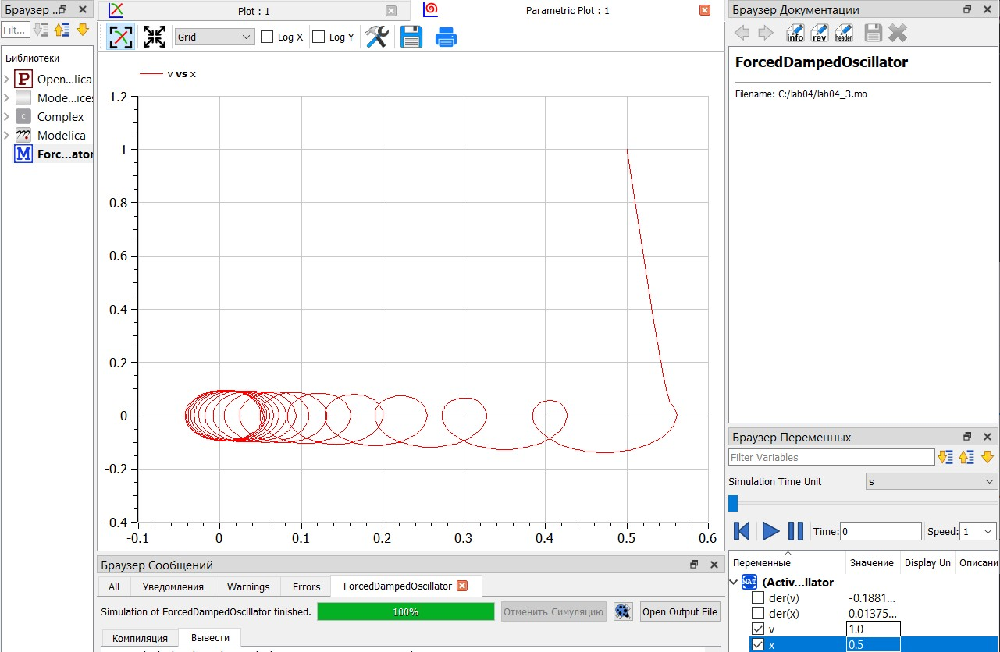{ #fig:012 width=70% }

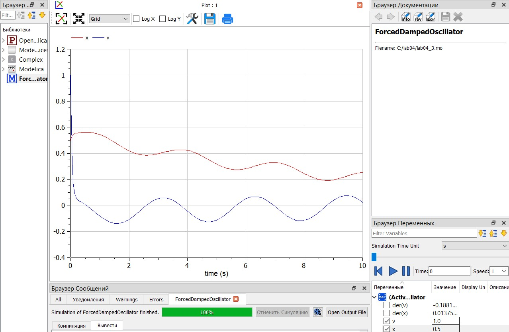{ #fig:013 width=70% }

# Заключение

 Реализовали модели для гармонических колебаний. Построили графики фазовых портретов и решения дифференциальных уравнений. 

# Ответы на вопросы

### Запишите простейшую модель гармонических колебаний
Простейшая модель гармонических колебаний описывается дифференциальным уравнением:
$$ \ddot{x} + \omega^2 x = 0 $$
где \( x \) — смещение от положения равновесия, \( \omega \) — циклическая частота колебаний.

### Дайте определение осциллятора
Осциллятор — это физическая система, способная совершать колебания около положения статического равновесия при отсутствии или при наличии затухания.

### Запишите модель математического маятника
Модель математического маятника описывается уравнением:
$$ \ddot{\theta} + \frac{g}{l} \sin(\theta) = 0 $$
где ${\theta}$ — угол отклонения маятника от вертикали, \( g \) — ускорение свободного падения, \( l \) — длина нити.

### Запишите алгоритм перехода от дифференциального уравнения второго порядка к двум дифференциальным уравнениям первого порядка
Для перехода от дифференциального уравнения второго порядка к системе уравнений первого порядка используют метод введения дополнительной переменной:
1. Пусть у нас есть уравнение второго порядка $$\ddot{x} = f(x, \dot{x}, t)$$
2. Введем новую переменную $$ v = \dot{x} $$
3. Теперь у нас есть система:
   $$ \begin{cases} \dot{x} = v \\ \dot{v} = f(x, v, t) \end{cases} $$
   Эта система состоит из двух дифференциальных уравнений первого порядка.

### Что такое фазовый портрет и фазовая траектория?
Фазовый портрет — совокупность всех фазовых траекторий динамической системы в фазовом пространстве, отображающая поведение системы в целом.

Фазовая траектория — кривая в фазовом пространстве, которая соответствует одному конкретному движению системы, проходящему через различные фазовые состояния во времени.

# Библиографическая справка 

[1] Документация по Julia: https://docs.julialang.org/en/v1/

[2] Документация по OpenModelica: https://openmodelica.org/

[3] Документация по модели боевых действий: http://crm.ics.org.ru/uploads/crmissues/crm_2020_1/2020_01_14.pdf