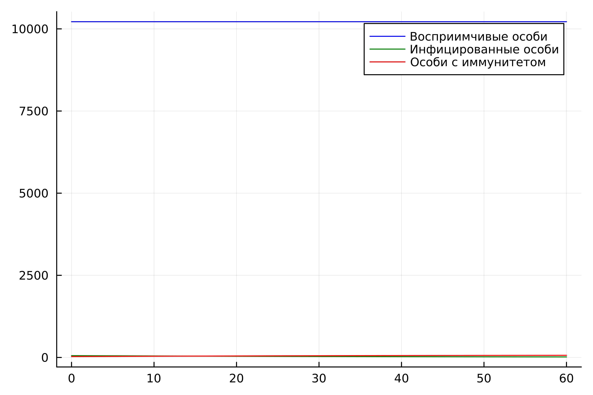
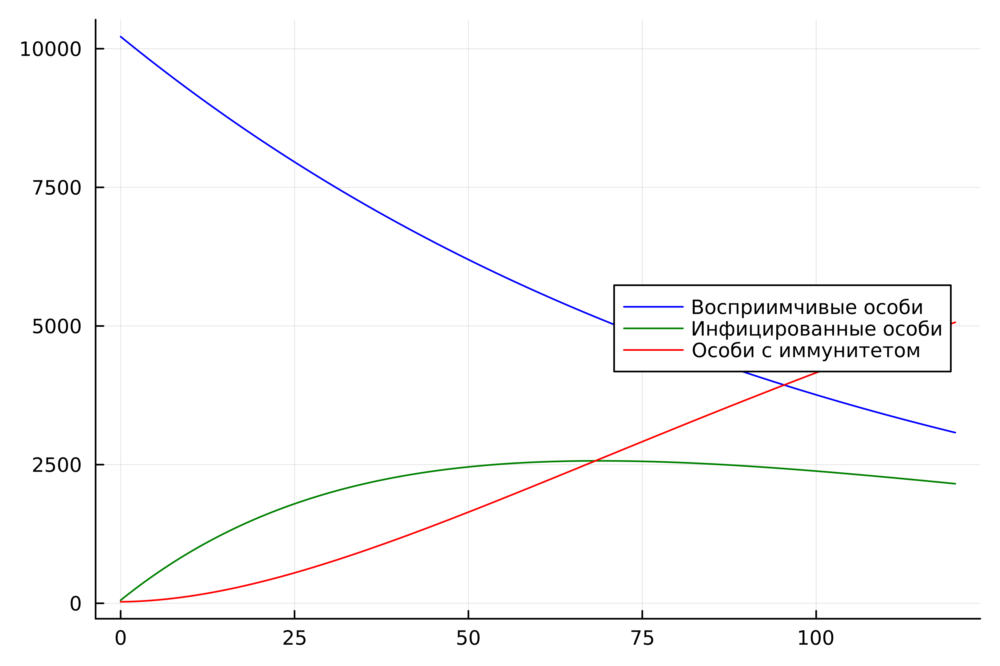
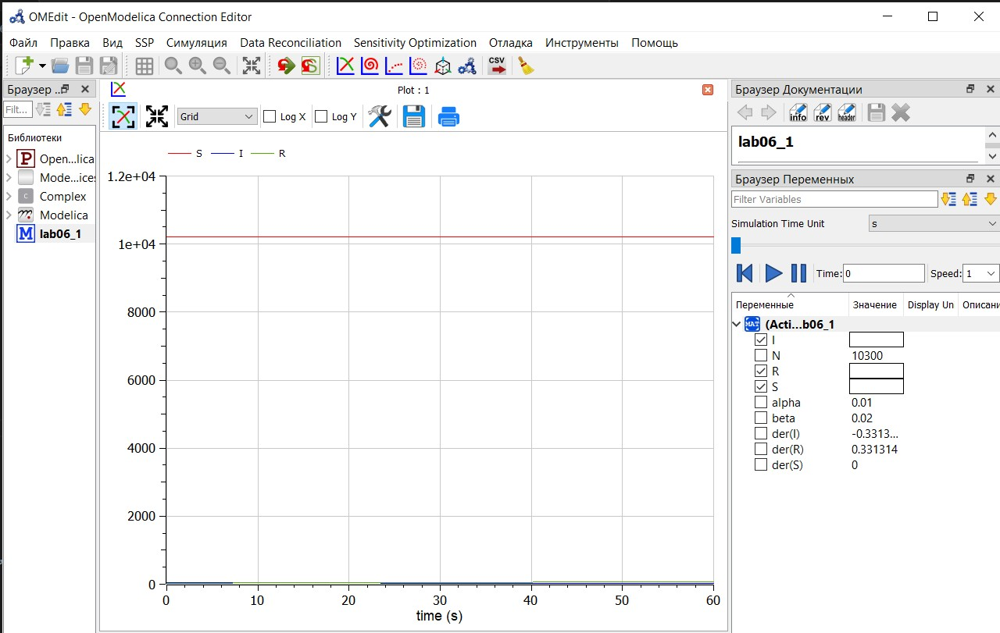
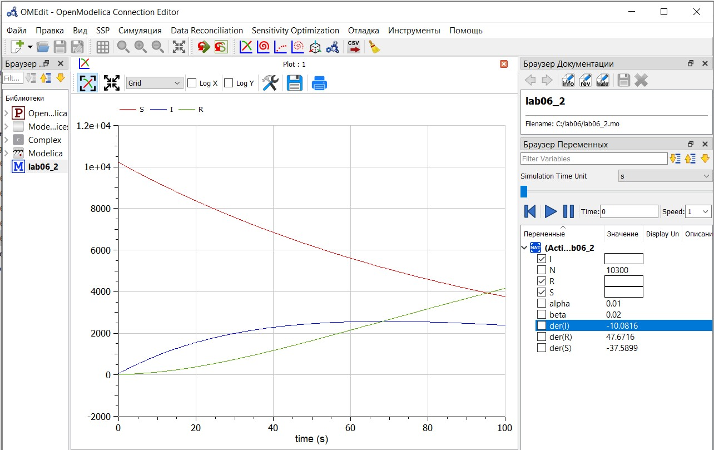

---
## Front matter
lang: ru-RU
title: "Лабораторная работа №6. Задача об эпидемии" 
subtitle: 
author: |
        Выполнила: Лебедева Ольга Андреевна
        \
        Преподаватель Кулябов Дмитрий Сергеевич д.ф.-м.н.,
        \ 
        профессор кафедры теории вероятностей и кибербезопасности
institute: |
           Российский университет дружбы народов, Москва, Россия
date: |
      2024

babel-lang: russian
babel-otherlangs: english
mainfont: Arial
monofont: Courier New
fontsize: 8pt

## Formatting
toc: false
slide_level: 2
theme: metropolis
header-includes: 
 - \metroset{progressbar=frametitle,sectionpage=progressbar,numbering=fraction}
 - '\makeatletter'
 - '\beamer@ignorenonframefalse'
 - '\makeatother'
aspectratio: 43
section-titles: true
---

## Цель работы

Рассмотреть простейшую задачу об эпидемии. Построить графики для двух случаев на Julia и OpenModelica: особи популяции изолированы / особи могут заражать друг друга.

## Теоретическое введение

Модель SIR является одной из наиболее известных и простых моделей для описания распространения инфекционных заболеваний в популяции. Эта модель разделяет популяцию на три основные группы: восприимчивые к инфекции (S, Susceptible), инфицированные (I, Infected) и выздоровевшие или иммунизированные (R, Recovered). Основное предположение модели заключается в том, что переход индивидуума из одного состояния в другое происходит с определёнными скоростями, которые могут быть описаны системой обыкновенных дифференциальных уравнений. [1].

## Задание

<i>Вариант 17 </i>

На одном острове вспыхнула эпидемия. Известно, что из всех проживающих на острове 
$(N=10300)$ в момент начала эпидемии $(t=0)$ число заболевших людей 
(являющихся распространителями инфекции) $I(0)=55$, А число здоровых людей с иммунитетом  к болезни $R(0)=27$. Таким образом, число людей восприимчивых к болезни,  но пока здоровых, в начальный момент времени $S(0)=N-I(0)-R(0)$. Постройте графики изменения числа особей в каждой из трех групп.

Рассмотрите, как будет протекать эпидемия в случае:

1.	$I(0)\leq I^*$

2.	$I(0)>I^*$

Построить графики изменения числа особей в каждой из трех групп $S$, $I$, $R$. Рассмотреть, как будет протекать эпидемия в этих случаях.

# Выполнение лабораторной работы

# Julia

## Julia. Случай 1

Напишем код на Jilia для случая 1: особи изолированы. 

    using Plots, DifferentialEquations

    N = 10300 # общее число особей
    I0 = 55 # заболевшие особи
    R0 = 27 # особи с иммунитетом
    S0 = N - I0 - R0 # здоровые, но восприимчивые особи

    alpha = 0.01 # коэффициент заболеваемости
    beta = 0.02 # коэффициент выздоровления

    #I0 <= I*
    function ode_fn(du, u, p, t)
        S, I, R = u
        du[1] = 0
        du[2] = -beta*u[2]
        du[3] = beta*I
    end

## Julia. Случай 1

    v0 = [S0, I0, R0]
    tspan = (0.0, 60.0)
    prob = ODEProblem(ode_fn, v0, tspan)
    sol = solve(prob, dtmax = 0.05)
    S = [u[1] for u in sol.u]
    I = [u[2] for u in sol.u]
    R = [u[3] for u in sol.u]
    T = [t for t in sol.t]

    plt = plot(dpi = 600, legend = :topright)
    plot!(plt, T, S, label = "Восприимчивые особи", color = :blue)
    plot!( plt, T, I, label = "Инфицированные особи", color = :green)
    plot!(plt, T, R, label = "Особи с иммунитетом", color = :red)

    savefig(plt, "lab06_1.png")

## Julia. Случай 1

Запустим код при помощи командной строки и получим изображение с динамикой численности популяции: Cм. [рис. 1](#fig:001)

{ #fig:001 width=70% }

## Julia. Случай 2

Напишем код на Jilia для случая 2: больные могут заражать особей группы S. 

    using Plots, DifferentialEquations

    N = 10300 # общее число особей
    I0 = 55 # заболевшие особи
    R0 = 27 # особи с иммунитетом
    S0 = N - I0 - R0 # здоровые, но восприимчивые особи

    alpha = 0.01 # коэффициент заболеваемости
    beta = 0.02 # коэффициент выздоровления

    #I0 > I*
    function ode_fn(du, u, p, t)
        S, I, R = u
        du[1] = -alpha*u[1]
        du[2] = alpha*u[1] - beta*u[2]
        du[3] = beta*I
    end

## Julia. Случай 2

    v0 = [S0, I0, R0]
    tspan = (0.0, 120.0)
    prob = ODEProblem(ode_fn, v0, tspan)
    sol = solve(prob, dtmax=0.05)
    S = [u[1] for u in sol.u]
    I = [u[2] for u in sol.u]
    R = [u[3] for u in sol.u]
    T = [t for t in sol.t]

    plt = plot(dpi=600, legend=:right)
    plot!(plt, T, S, label="Восприимчивые особи", color=:blue)
    plot!(plt, T, I, label="Инфицированные особи", color=:green)
    plot!(plt, T, R, label="Особи с иммунитетом", color=:red)

    savefig(plt, "lab06_2.png")

## Julia. Случай 2

Запустим код при помощи командной строки и получим изображениe: Cм. [рис. 2](#fig:002)

{ #fig:002 width=70% }

# OpenModelica

## OpenModelica. Случай 1

Напишем код на OpenModelica для случая 1: особи изолированы. 

    model lab06_1
    Real N = 10300;
    Real I;
    Real R;
    Real S;
    Real alpha = 0.01;
    Real beta = 0.02;
    initial equation
    I = 55;
    R = 27;
    S = N - I - R;
    equation
    der(S) = 0;
    der(I) = -beta*I;
    der(R) = beta*I;
    end lab06_1;

## OpenModelica. Случай 1

Запустим код при помощи кнопок "проверить модель" -> "симулировать". Не забываем в настройках указать заданные нам начальные условия (время). Cм. [рис. 3](#fig:003)

{ #fig:003 width=70% }

## OpenModelica. Случай 2

Напишем код для случая 2: ольные могут заражать особей группы S.

    model lab06_2
    Real N = 10300;
    Real I;
    Real R;
    Real S;
    Real alpha = 0.01;
    Real beta = 0.02;
    initial equation
    I = 55;
    R = 27;
    S = N - I - R;
    equation
    der(S) = -alpha*S;
    der(I) = alpha*S - beta*I;
    der(R) = beta*I;
    end lab06_2;

## OpenModelica. Случай 2

Запустим код: Cм. [рис. 4](#fig:004)

{ #fig:004 width=70% }

## OpenModelica. Случай 2

Из графика видно, что первоначально популяция в основном состоит из восприимчивых к инфекции людей (S), их количество резко сокращается с течением времени. Это связано с переходом людей из этой группы в группу инфицированных (I), что видно по увеличению количества инфицированных, которое достигает пика примерно в середине рассматриваемого периода времени.

После достижения пика, количество инфицированных начинает уменьшаться, что указывает на выздоровление людей и переход их в группу иммунных (R). Соответственно, количество выздоровевших со временем растёт.

## OpenModelica. Случай 2

Несколько моментов, на которые стоит обратить внимание:

1. Пик эпидемии (максимальное число инфицированных) наступает примерно после 30 секунд на графике.

2. Скорость распространения инфекции в начале эпидемии высока, так как большое количество восприимчивых встречаются с инфицированными.

3. По мере уменьшения восприимчивых и увеличения выздоровевших скорость распространения инфекции замедляется.

4. К концу рассматриваемого периода на графике, количество восприимчивых сильно уменьшилось, что может указывать на охват инфекцией большей части популяции и на формирование иммунитета.

## Заключение

Рассмотрели простейшую задачу об эпидемии. Построили графики для двух случаев на Julia и OpenModelica: для изолированных особей популяции / для особей, которые подвержены заражению.

## Библиографическая справка 

[1] Задача об эпидемии: https://cyberleninka.ru/article/n/uchebnaya-model-razvitiya-epidemii