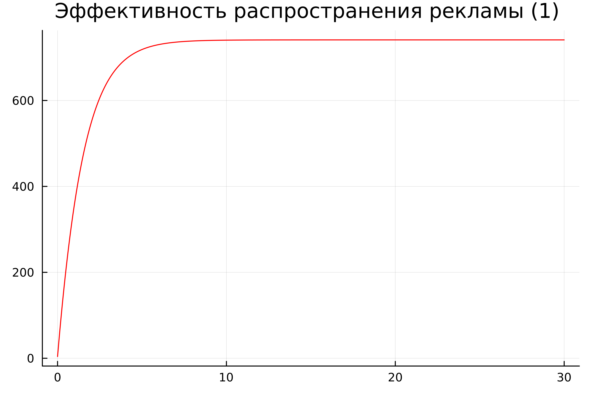
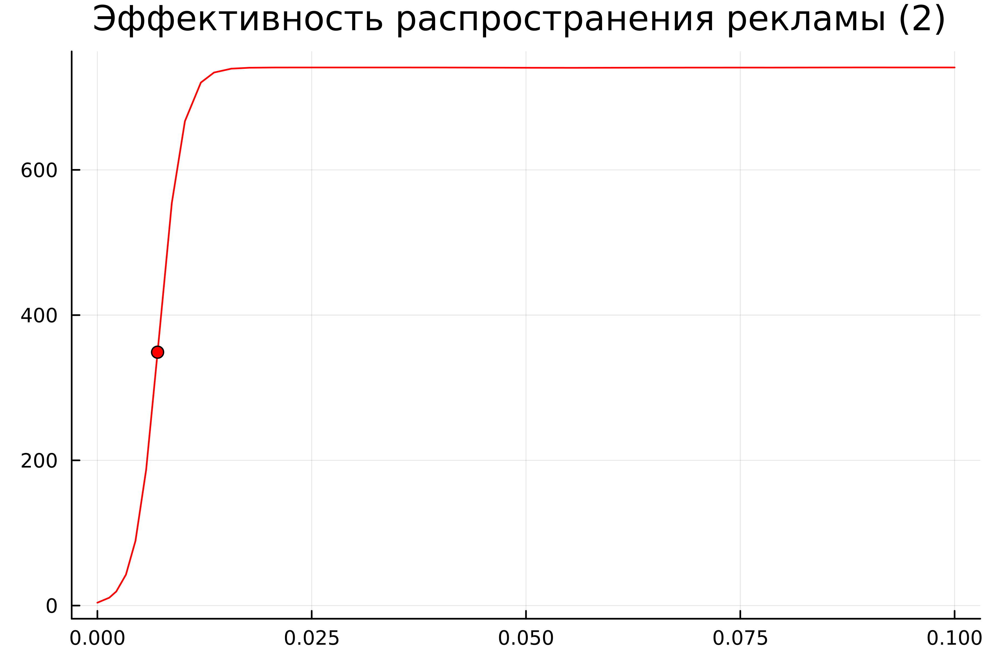
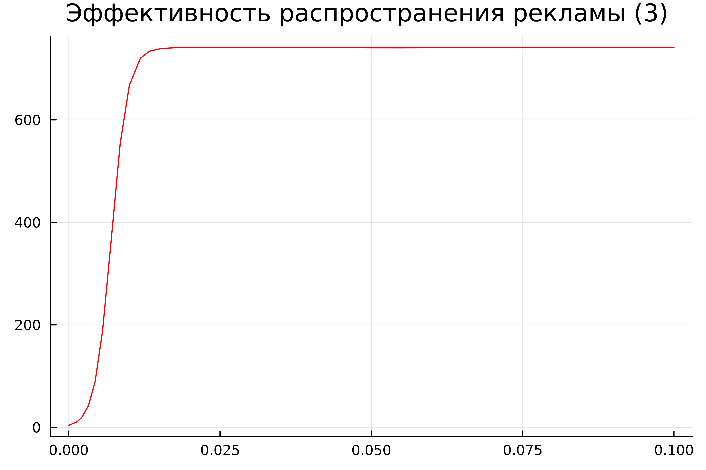

---
## Front matter
title: "Отчет по лабораторной работе № 7"
subtitle: "Эффективность рекламы"
author: "Лебедева Ольга Андреевна"

## Generic otions
lang: ru-RU
toc-title: "Содержание"

## Bibliography
bibliography: bib/cite.bib
csl: pandoc/csl/gost-r-7-0-5-2008-numeric.csl

## Pdf output format
toc: true # Table of contents
toc-depth: 2
lof: true # List of figures
#lot: true # List of tables
fontsize: 12pt
linestretch: 1.5
papersize: a4
documentclass: scrreprt
## I18n polyglossia
polyglossia-lang:
  name: russian
  options:
	- spelling=modern
	- babelshorthands=true
polyglossia-otherlangs:
  name: english
## I18n babel
babel-lang: russian
babel-otherlangs: english
## Fonts
mainfont: PT Serif
romanfont: PT Serif
sansfont: PT Sans
monofont: PT Mono
mainfontoptions: Ligatures=TeX
romanfontoptions: Ligatures=TeX
sansfontoptions: Ligatures=TeX,Scale=MatchLowercase
monofontoptions: Scale=MatchLowercase,Scale=0.9
## Biblatex
biblatex: true
biblio-style: "gost-numeric"
biblatexoptions:
  - parentracker=true
  - backend=biber
  - hyperref=auto
  - language=auto
  - autolang=other*
  - citestyle=gost-numeric
## Pandoc-crossref LaTeX customization
figureTitle: "Рис."
tableTitle: "Таблица"
listingTitle: "Листинг"
lofTitle: "Список иллюстраций"
lotTitle: "Список таблиц"
lolTitle: "Листинги"
## Misc options
indent: true
header-includes:
  - \usepackage{indentfirst}
  - \usepackage{float} # keep figures where there are in the text
  - \floatplacement{figure}{H} # keep figures where there are in the text
---

# Цель работы

Рассмотреть и решить задачу об эффективности рекламы на языках Julia[1] и OpenModelica[2].

# Теоретическое введение

Организуется рекламная кампания нового товара или услуги. Необходимо, чтобы прибыль будущих продаж с избытком покрывала издержки на рекламу. Вначале расходы могут превышать прибыль, поскольку лишь малая часть потенциальных покупателей будет информирована о новинке. Затем, при увеличении числа продаж, возрастает и прибыль, и, наконец, наступит момент, когда рынок насытиться, и рекламировать товар станет бесполезным [3].

Предположим, что торговыми учреждениями реализуется некоторая продукция, о которой в момент времени $t$ из числа потенциальных покупателей $N$ знает лишь $n$ покупателей. Для ускорения сбыта продукции запускается реклама по радио, телевидению и других средств массовой информации. После запуска рекламной кампании информация о продукции начнет распространяться среди потенциальных покупателей путем общения друг с другом. Таким образом, после запуска рекламных объявлений скорость изменения числа знающих о продукции людей пропорциональна как числу знающих о товаре покупателей, так и числу покупателей о нем не знающих

Модель рекламной кампании описывается следующими величинами.
Считаем, что $\frac{dn}{dt}$ - скорость изменения со временем числа потребителей, узнавших о товаре и готовых его купить, $t$ - время, прошедшее с начала рекламной кампании, $N$ - общее число потенциальных платежеспособных покупателей, $n(t)$ - число  уже информированных клиентов. Эта величина пропорциональна числу покупателей, еще не знающих о нем, это описывается следующим образом: $\alpha _1(t)(N-n(t))$, где $\alpha _1>0$ -  характеризует интенсивность рекламной кампании (зависит от затрат на рекламу в данный момент времени).
Помимо этого, узнавшие о товаре потребители также распространяют полученную информацию среди потенциальных покупателей, не знающих о нем (в этом случае работает т.н. сарафанное радио). Этот вклад в рекламу описывается величиной  $\alpha _2(t)n(t)(N-n(t))$. эта величина увеличивается с увеличением потребителей узнавших о товаре.
Математическая модель распространения рекламы описывается уравнением:

$$\frac{dn}{dt} = (\alpha _1(t) + \alpha _2(t)n(t))(N-n(t))$$

# Задание

<i>Вариант 17 </i>

Постройте график распространения рекламы, математическая модель которой описывается следующим уравнением:

1.	$\frac{dn}{dt} = (0.63 + 0.000013n(t))(N-n(t))$
2.	$\frac{dn}{dt} = (0.000035 + 0.98n(t))(N-n(t))$
3.	$\frac{dn}{dt} = (0.65sin(7t) + \cos{(3t)} n(t))(N-n(t))$

При этом объем аудитории $N = 741$, в начальный момент о товаре знает 4 человек. Для случая 2 определите в какой момент времени скорость распространения рекламы будет иметь максимальное значение.

# Выполнение лабораторной работы

## Julia

Напишем код на Jilia для случая 1: $\frac{dn}{dt} = (0.63 + 0.000013n(t))(N-n(t))$

    using Plots
    using DifferentialEquations

    N = 741
    n0 = 4

    function ode_fn(du, u, p, t)
        (n) = u
        du[1] = (0.63 + 0.00013*u[1])*(N - u[1])
    end

    v0 = [n0]
    tspan = (0.0, 30.0)
    prob = ODEProblem(ode_fn, v0, tspan)
    sol = solve(prob, dtmax = 0.05)
    n = [u[1] for u in sol.u]
    T = [t for t in sol.t]

    plt = plot(dpi = 600, title = "Эффективность распространения рекламы (1) ", legend = false)
    plot!(plt, T, n, color = :red)
    savefig(plt, "lab07_1.png")

Запустим код при помощи командной строки и получим изображение с динамикой эффективности рекламы во времени: Cм. [рис. 1](#fig:001)

{ #fig:001 width=70% }

Напишем код на Jilia для случая 2: $\frac{dn}{dt} = (0.000035 + 0.98n(t))(N-n(t))$

    using Plots
    using DifferentialEquations

    N = 741
    n0 = 4

    function ode_fn(du, u, p, t)
        (n) = u
        du[1] = (0.000035 + 0.98*u[1])*(N - u[1])
    end

    v0 = [n0]
    tspan = (0.0, 0.1)
    prob = ODEProblem(ode_fn, v0, tspan)
    sol = solve(prob)
    n = [u[1] for u in sol.u]
    T = [t for t in sol.t]

    max_dn = 0;
    max_dn_t = 0;
    max_dn_n = 0;
    for (i, t) in enumerate(T)
        if sol(t, Val{1})[1] > max_dn
            global max_dn = sol(t, Val{1})[1]
            global max_dn_t = t
            global max_dn_n = n[i]
        end
    end

    plt = plot(dpi = 600, title = "Эффективность распространения рекламы (2) ", legend = false)
    plot!(plt, T, n, color = :red)
    plot!(plt, [max_dn_t], [max_dn_n], seriestype = :scatter, color = :red)
    savefig(plt, "lab07_2.png")

Запустим код при помощи командной строки и получим изображениe: Cм. [рис. 2](#fig:002)

{ #fig:002 width=70% }

Напишем код на Jilia для случая 3: $\frac{dn}{dt} = (0.65sin(7t) + \cos{(3t)} n(t))(N-n(t))$

    using Plots
    using DifferentialEquations

    N = 741
    n0 = 4

    function ode_fn(du, u, p, t)
        (n) = u
        du[1] = (0.65*sin(7*t) + cos(3*t)*u[1])*(N - u[1])
    end

    v0 = [n0]
    tspan = (0.0, 0.1)
    prob = ODEProblem(ode_fn, v0, tspan)
    sol = solve(prob, dtmax = 0.05)
    n = [u[1] for u in sol.u]
    T = [t for t in sol.t]

    plt = plot(dpi = 600, title = "Эффективность распространения рекламы (3) ", legend = false)
    plot!(plt, T, n, color = :red)
    savefig(plt, "lab07_3.png")

Запустим код при помощи командной строки и получим изображениe: Cм. [рис. 3](#fig:003)

{ #fig:003 width=70% }

## OpenModelica

Напишем код на OpenModelica для случая 1: $\frac{dn}{dt} = (0.63 + 0.000013n(t))(N-n(t))$

    model lab07_1
    Real N = 741;
    Real n;
    initial equation
    n = 4;
    equation
    der(n) = (0.63 + 0.00013*n)*(N-n);
    end lab07_1;

Запустим код при помощи кнопок "проверить модель" -> "симулировать". Не забываем в настройках указать заданные нам начальные условия (время). Cм. [рис. 4](#fig:004)

{ #fig:004 width=70% }

Напишем код на OpenModelica для случая 2: $\frac{dn}{dt} = (0.000035 + 0.98n(t))(N-n(t))$

    model lab07_2
    Real N = 741;
    Real n;
    initial equation
    n = 4;
    equation
    der(n) = (0.000035 + 0.95*n)*(N-n);
    end lab07_2;

Запустим код при помощи кнопок "проверить модель" -> "симулировать". Не забываем в настройках указать заданные нам начальные условия (время). Cм. [рис. 5](#fig:005)

{ #fig:005 width=70% }

Напишем код на OpenModelica для случая 3: $\frac{dn}{dt} = (0.65sin(7t) + \cos{(3t)} n(t))(N-n(t))$

    model lab07_3
    Real N = 741;
    Real n;
    initial equation
    n = 4;
    equation
    der(n) = (0.65 * sin(7*time) + cos(3*time)*n)*(N-n);
    end lab07_3;

Запустим код при помощи кнопок "проверить модель" -> "симулировать". Не забываем в настройках указать заданные нам начальные условия (время). Cм. [рис. 6](#fig:006)

{ #fig:006 width=70% }

# Заключение

Рассмотрели и решили задачу об эффективности рекламы на языках Julia и OpenModelica. Получили идентичные результаты. Отметили, что на языке OpenModelica реализация более ёмкая, нежели на языке Julia.

# Ответы на вопросы

1. Модель Мальтуса является математическим описанием экспоненциального роста популяции. В ее основе лежит предположение о том, что скорость роста популяции пропорциональна текущему размеру этой популяции. Модель Мальтуса широко используется в демографических и экономических исследованиях для оценки тенденций роста населения и ресурсов.

2. Логистическое уравнение описывает рост популяции или другой системы, учитывая наличие ограничений на рост, таких как конечные ресурсы или конкуренция. Уравнение имеет форму $ \frac{dN}{dt} = rN(1-\frac{N}{K}) $, где $ N $ - текущий размер популяции, $ r $ - коэффициент роста, а $ K $ - предельная емкость окружающей среды, то есть максимальный размер популяции, который может быть поддержан данными ресурсами.

3. Коэффициенты $ \alpha₁(t) $ и $ \alpha₂(t) $ в модели распространения рекламы влияют на скорость распространения рекламы во времени. $ \alpha₁(t) $ обычно отражает эффективность рекламной кампании и может зависеть, например, от бюджета на рекламу или качества рекламного контента. $ \alpha₂(t) $ может отражать факторы, которые могут препятствовать или ускорять распространение рекламы, такие как конкуренция на рынке или изменения в предпочтениях потребителей.

4. Когда $ \alpha₁(t) >> \alpha₂(t) $, скорость распространения рекламы будет определяться в основном эффективностью рекламной кампании. Это может привести к более быстрому и интенсивному распространению рекламы и увеличению числа клиентов.

5. Когда $ \alpha₁(t) < \alpha₂(t) $, факторы, препятствующие распространению рекламы, становятся более существенными, чем эффективность самой рекламы. В таком случае скорость распространения рекламы может быть замедлена, и ее влияние на количество клиентов может быть ограничено.

# Библиографическая справка 

[1] Документация по Julia: https://docs.julialang.org/en/v1/

[2] Документация по OpenModelica: https://openmodelica.org/

[3] Мальтузианская модель роста: https://www.stolaf.edu//people/mckelvey/envision.dir/malthus.html